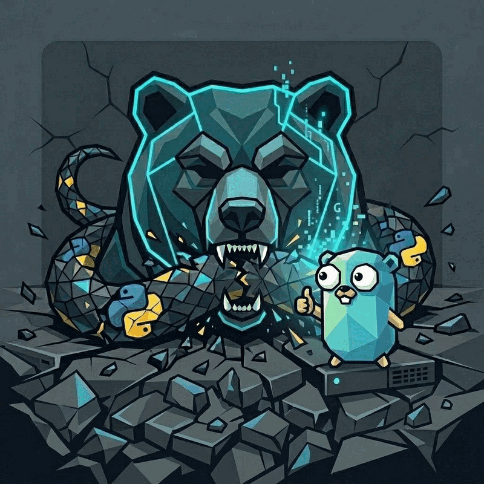

<p align="center">
  
</p>

<p align="center">
  
</p>

<h1 align="center">Gormes</h1>

<p align="center"><strong>Always-On Agent Runtime</strong></p>

<p align="center">
  <strong>One binary. Zero dependencies. No drift.</strong><br>
  <em>The Agent That GOes With You</em>
</p>

<p align="center">
  <a href="https://docs.gormes.ai/"></a>
  <a href="https://github.com/TrebuchetDynamics/gormes"></a>
  <a href="https://github.com/TrebuchetDynamics/gormes/blob/main/LICENSE"></a>
  <a href="https://gormes.ai"></a>
</p>

**Gormes is a single-binary runtime for AI agents that stays alive without Python, environments, or orchestration overhead.** Deploy one static binary (~17 MB) that runs from a $4 VPS to an Android phone. No `pip install` hell. No GIL bottlenecks. No dependency drift. Just copy the binary and run it.

As models get smarter, the bottleneck shifts from intelligence to **runtime reliability**. Gormes is built for the utility phase: when you need agents that survive restarts, deploy anywhere, and run for months without babysitting.

Use any model — [Nous Portal](https://portal.nousresearch.com), [OpenRouter](https://openrouter.ai) (200+ models), [NVIDIA NIM](https://build.nvidia.com), [Xiaomi MiMo](https://platform.xiaomimimo.com), [z.ai/GLM](https://z.ai), [Kimi/Moonshot](https://platform.moonshot.ai), [MiniMax](https://www.minimax.io), [Hugging Face](https://huggingface.co), OpenAI, or your own endpoint. Switch with `gormes model` — no code changes, no lock-in.

<table>
<tr><td><b>A real terminal interface</b></td><td>Full TUI with multiline editing, slash-command autocomplete, conversation history, interrupt-and-redirect, and streaming tool output.</td></tr>
<tr><td><b>Lives where you do</b></td><td>Telegram, Discord, Slack, WhatsApp, Signal, and CLI from one runtime. Voice memo transcription and cross-platform conversation continuity stay intact.</td></tr>
<tr><td><b>A closed learning loop</b></td><td>Agent-curated memory with periodic nudges. Autonomous skill creation after complex tasks. Skills self-improve during use. FTS5 session search with LLM summarization for cross-session recall. <a href="https://github.com/plastic-labs/honcho">Honcho</a> dialectic user modeling. Compatible with the <a href="https://agentskills.io">agentskills.io</a> open standard.</td></tr>
<tr><td><b>Scheduled automations</b></td><td>Built-in cron scheduler with delivery to any platform. Daily reports, nightly backups, and weekly audits in natural language, running unattended.</td></tr>
<tr><td><b>Isolated subagents</b></td><td>Spawn parallel workstreams with resource isolation. Each subagent gets its own context, tool sandbox, and cancellation scope—failures don't cascade to the parent.</td></tr>
<tr><td><b>Runs anywhere, not just your laptop</b></td><td>Deploy the same static binary across local machines, containers, VPS instances, WSL, and Android/Termux. Serverless and remote execution patterns still fit; the packaging friction disappears.</td></tr>
<tr><td><b>Research-ready</b></td><td>Batch trajectory generation, Atropos RL environments, and trajectory compression for training the next generation of tool-calling models.</td></tr>
</table>

---

## Why Gormes?

We are moving out of the "magic" phase of AI and into the **utility phase**.

The problem is no longer whether an agent can think. The problem is whether it can **stay alive 24/7** without being babysat through interpreter drift, broken virtual environments, and runtime coordination pain.

Gormes exists because serious agents need a serious host:

- **Dependency hell is not a feature.** Python packaging drift, environment mismatch, and activation rituals are operational tax.
- **The GIL is not the future of always-on agent infrastructure.** High-fanout gateways, streams, cron jobs, MCP sessions, and long-lived conversations want a runtime built for concurrency.
- **Environment fragility kills autonomy.** A smart agent that falls over because the host moved underneath it is not production-grade.
- **Zero-dependency deployment changes adoption.** One binary that can be copied, restarted, and trusted is a different product from a fragile app stack.

### What We Mean by "Zero-Entropy"

The term describes systems that resist drift over time:

| Entropy Source | How Gormes Eliminates It |
|----------------|-------------------------|
| **Environment drift** | Single static binary—no Python version, no pip dependencies, no venv corruption |
| **Dependency rot** | Zero runtime dependencies beyond libc; same binary works for years |
| **Configuration divergence** | Deterministic startup from config files; no hidden state in environment variables |
| **Deployment unpredictability** | Build once, run anywhere: x86_64, ARM64, WSL, containers, bare metal |
| **Resource leaks** | Bounded goroutines, context cancellation, graceful shutdown on SIGTERM |

The result: **cold start < 100ms**, **< 20 MB RSS at idle**, deterministic behavior across deploys.

---

## Install

```bash
# Download the single static binary (Linux/macOS/Windows)
curl -fsSL https://gormes.ai/install.sh | sh

# Or build from source
go install github.com/TrebuchetDynamics/gormes@latest
```

No Python bootstrap, no virtualenv activation, no dependency pin fallout. Install one binary and run it.

After installation:

```bash
gormes              # start chatting
```

---

## Getting Started

```bash
gormes              # Interactive CLI — start a conversation
gormes model        # Choose your LLM provider and model
gormes tools        # Configure which tools are enabled
gormes config set   # Set individual config values
gormes gateway      # Start the messaging gateway (Telegram, Discord, etc.)
gormes setup        # Run the full setup wizard (configures everything at once)
gormes claw migrate # Migrate from OpenClaw (if coming from OpenClaw)
gormes update       # Update to the latest version
gormes doctor       # Diagnose any issues
```

📖 **[Full documentation →](https://docs.gormes.ai/)**

---

## Architecture

Gormes is not "an AI agent." It is **the operating system for agents**—infrastructure that manages agent lifecycles, memory, tool execution, and platform gateways.

Your real competitors aren't other chatbots. They're:
- Docker + Python stacks (complex orchestration)
- Serverless workflows (cold start latency)
- Workflow engines (limited autonomy)

Gormes wins by being simpler, faster, and more reliable than all of them.

### Core Design

- **Single-binary runtime**: CLI, gateway, cron, and tool orchestration ship as one deployable artifact. Deploy with `scp`, run with `./gormes`.
- **Go concurrency model**: Goroutines and channels replace Python's GIL. Stream turns, background jobs, gateway fan-out, and tool calls share one process without contention.
- **Bounded resource guarantees**: Memory limits, context cancellation, and circuit breakers prevent runaway agents from consuming the host.
- **Phase 1 Strangler Fig**: The current bridge provides immediate value for Hermes users, but is a temporary tactical layer. The Go core takes over the full lifecycle subsystem by subsystem.

### Subagent Isolation Model

When you spawn subagents for parallel work:

| Resource | Isolation Level | Behavior |
|----------|----------------|----------|
| **Memory** | Soft limits | Each subagent has configurable max memory; exceeded → graceful termination |
| **Context** | Full isolation | Independent conversation context; no accidental cross-contamination |
| **Tools** | Sandboxed | Subagent tools run in restricted environment; no filesystem escape |
| **Cancellation** | Scoped | Parent cancellation propagates; subagent can timeout independently |
| **Failure** | Contained | Subagent crashes don't cascade; parent receives error, not panic |

This is **process-adjacent isolation** within a single binary—not separate processes, but strict logical boundaries with resource accounting.

---

## Security by Design

Gormes treats security as a core feature, not an afterthought:

- **No supply chain dependencies**: Single binary eliminates pip/package.json attack surfaces
- **Controlled tool execution**: Dangerous operations require explicit user approval; allowlists prevent surprises
- **Sandboxed filesystem**: Tool file access respects working directory boundaries
- **Credential isolation**: API keys stored in user config, not environment variables; isolated per-profile
- **Audit logging**: Optional JSONL logs of all tool executions for compliance (off by default)
- **Container-ready**: Runs as non-root in minimal containers (Distroless, Alpine)

See the [Security Guide](https://docs.gormes.ai/user-guide/security) for details on command approval, DM pairing, and container isolation.

---

## CLI vs Messaging Quick Reference

Gormes has two entry points: start the terminal UI with `gormes`, or run the gateway and talk to it from Telegram, Discord, Slack, WhatsApp, Signal, or Email. Once you're in a conversation, many slash commands are shared across both interfaces.

| Action | CLI | Messaging platforms |
|---------|-----|---------------------|
| Start chatting | `gormes` | Run `gormes gateway setup` + `gormes gateway start`, then send the bot a message |
| Start fresh conversation | `/new` or `/reset` | `/new` or `/reset` |
| Change model | `/model [provider:model]` | `/model [provider:model]` |
| Set a personality | `/personality [name]` | `/personality [name]` |
| Retry or undo the last turn | `/retry`, `/undo` | `/retry`, `/undo` |
| Compress context / check usage | `/compress`, `/usage`, `/insights [--days N]` | `/compress`, `/usage`, `/insights [days]` |
| Browse skills | `/skills` or `/<skill-name>` | `/skills` or `/<skill-name>` |
| Interrupt current work | `Ctrl+C` or send a new message | `/stop` or send a new message |
| Platform-specific status | `/platforms` | `/status`, `/sethome` |

For the full command lists, see the [CLI guide](https://docs.gormes.ai/user-guide/cli) and the [Messaging Gateway guide](https://docs.gormes.ai/user-guide/messaging).

---

## Documentation

All documentation lives at **[docs.gormes.ai](https://docs.gormes.ai/)**:

| Section | What's Covered |
|---------|---------------|
| [Quickstart](https://docs.gormes.ai/getting-started/quickstart) | Install → setup → first conversation in 2 minutes |
| [CLI Usage](https://docs.gormes.ai/user-guide/cli) | Commands, keybindings, personalities, sessions |
| [Configuration](https://docs.gormes.ai/user-guide/configuration) | Config file, providers, models, all options |
| [Messaging Gateway](https://docs.gormes.ai/user-guide/messaging) | Telegram, Discord, Slack, WhatsApp, Signal, Home Assistant |
| [Security](https://docs.gormes.ai/user-guide/security) | Command approval, DM pairing, container isolation, audit logging |
| [Tools & Toolsets](https://docs.gormes.ai/user-guide/features/tools) | 40+ tools, toolset system, terminal backends |
| [Skills System](https://docs.gormes.ai/user-guide/features/skills) | Procedural memory, Skills Hub, creating skills |
| [Memory](https://docs.gormes.ai/user-guide/features/memory) | Persistent memory, user profiles, best practices |
| [MCP Integration](https://docs.gormes.ai/user-guide/features/mcp) | Connect any MCP server for extended capabilities |
| [Cron Scheduling](https://docs.gormes.ai/user-guide/features/cron) | Scheduled tasks with platform delivery |
| [Context Files](https://docs.gormes.ai/user-guide/features/context-files) | Project context that shapes every conversation |
| [Architecture](https://docs.gormes.ai/developer-guide/architecture) | System design, Go runtime model, key subsystems |
| [Contributing](https://docs.gormes.ai/developer-guide/contributing) | Development setup, PR process, code style |
| [CLI Reference](https://docs.gormes.ai/reference/cli-commands) | All commands and flags |
| [Environment Variables](https://docs.gormes.ai/reference/environment-variables) | Complete env var reference |

---

## Migrating from OpenClaw

If you're coming from OpenClaw, Gormes can automatically import your settings, memories, skills, and API keys.

**During first-time setup:** The setup wizard (`gormes setup`) automatically detects `~/.openclaw` and offers to migrate before configuration begins.

**Anytime after install:**

```bash
gormes claw migrate                       # Interactive migration (full preset)
gormes claw migrate --dry-run             # Preview what would be migrated
gormes claw migrate --preset user-data    # Migrate without secrets
gormes claw migrate --overwrite           # Overwrite existing conflicts
```

What gets imported:
- **SOUL.md** — persona file
- **Memories** — MEMORY.md and USER.md entries
- **Skills** — user-created skills imported into the local Gormes skill store
- **Command allowlist** — approval patterns
- **Messaging settings** — platform configs, allowed users, working directory
- **API keys** — allowlisted secrets (Telegram, OpenRouter, OpenAI, Anthropic, ElevenLabs)
- **TTS assets** — workspace audio files
- **Workspace instructions** — AGENTS.md (with `--workspace-target`)

See `gormes claw migrate --help` for all options, or use the `openclaw-migration` skill for an interactive agent-guided migration with dry-run previews.

---

## Contributing

We welcome contributions. See the [Contributing Guide](https://docs.gormes.ai/developer-guide/contributing) for development setup, code style, and PR process.

Quick start for contributors:

```bash
git clone https://github.com/TrebuchetDynamics/gormes.git
cd gormes
make build
./bin/gormes
```

---

## Community

- 🌐 [Website](https://gormes.ai)
- 📖 [Documentation](https://docs.gormes.ai/)
- 📚 [Skills Hub](https://agentskills.io)
- 🐛 [Issues](https://github.com/TrebuchetDynamics/gormes/issues)
- 💡 [Discussions](https://github.com/TrebuchetDynamics/gormes/discussions)

---

## License

MIT — see [LICENSE](LICENSE).

Built by [Trebuchet Dynamics](https://gormes.ai). Original Hermes Agent lineage by [Nous Research](https://nousresearch.com), carried forward under the MIT License.
